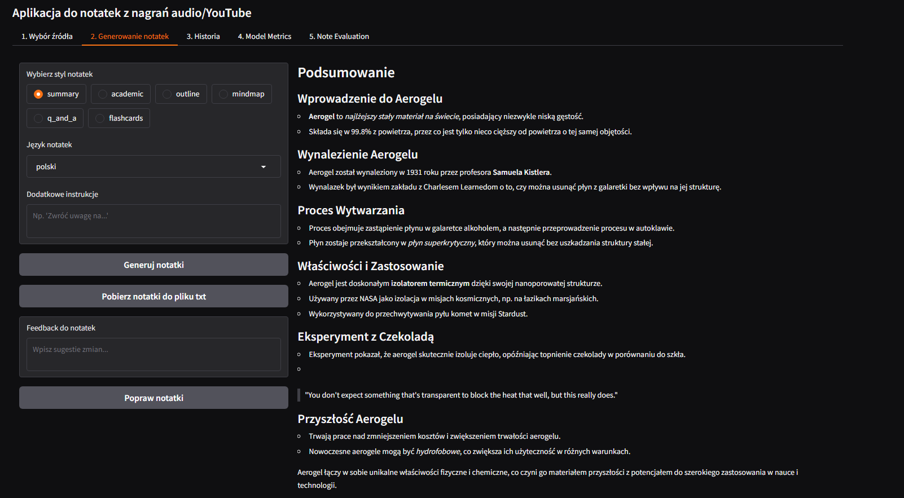

# AI-Powered Note-Taking Assistant

A sophisticated application that automatically generates, translates, and evaluates notes from YouTube videos and audio files using AI. Built with Python, leveraging OpenAI's GPT-4 and Whisper models, along with advanced translation capabilities.



## 🌟 Features

### 1. Transcription
- YouTube video transcription with automatic language detection
- Audio file transcription using OpenAI's Whisper API
- Automatic saving of transcripts to files

### 2. Note Generation
Multiple note-taking styles available:
- Summary
- Academic notes
- Outline
- Mind map
- Q&A format
- Flashcards

### 3. Translation Support
- Multi-language support (Polish, English, Spanish)
- Neural machine translation using Helsinki-NLP models
- Translation quality metrics and evaluation

### 4. Interactive Refinement
- Real-time note refinement based on user feedback
- Version history tracking
- Change tracking and documentation

### 5. Quality Assessment
- Automated evaluation of note quality across multiple aspects:
  - Harmfulness check
  - Coherence analysis
  - Factual correctness
  - Conciseness evaluation
- Detailed feedback and improvement suggestions

### 6. Performance Metrics
- Translation quality metrics
- Visualization of model performance
- Precision, recall, and F1 score calculations

## 🚀 Getting Started

### Prerequisites
- Python 3.8+
- OpenAI API key

### Installation

1. Clone the repository:
```bash
git clone <repository-url>
cd <project-directory>
```

2. Create and activate a virtual environment:
```bash
python -m venv venv
source venv/bin/activate  # On Windows: venv\Scripts\activate
```

3. Install dependencies:
```bash
pip install -r requirements.txt
```

4. Create a `.env` file in the project root and add your OpenAI API key:

```

### Running the Application

1. Start the application:
```bash
python main.py
```

2. Access the web interface through your browser (default: http://localhost:7860)

## 💡 Usage Guide

### 1. Source Selection
- Paste a YouTube URL or upload an audio file
- Click "Get Transcript" to generate the transcription

### 2. Note Generation
- Select your preferred note style
- Choose the target language
- Add any specific instructions
- Click "Generate Notes"

### 3. Note Refinement
- Provide feedback in the feedback box
- Click "Refine Notes" to apply changes
- View the change history in the History tab

### 4. Quality Assessment
- Use the "Note Evaluation" tab to assess note quality
- Review detailed feedback across multiple aspects
- Check translation metrics in the "Model Metrics" tab

## 🛠 Technical Architecture

The application is built with a modular architecture consisting of several key components:

### Agents
- `ManagerAgent`: Coordinates the overall process
- `NoteTakingAgent`: Handles initial note generation
- `ReviewAgent`: Manages note refinement
- `TranslationAgent`: Handles language translation

### Core Components
- Gradio-based UI for interactive interface
- Version control system for note history
- Metrics calculation and visualization
- File management system

## 📊 Metrics and Evaluation

The system provides comprehensive metrics for:
- Translation quality (BLEU score, precision, recall, F1)
- Note quality aspects (harmfulness, coherence, correctness, conciseness)
- Visual representation of performance metrics

## 🔒 Security and Error Handling

- Input validation and sanitization
- Comprehensive error handling
- Secure file operations
- Environment variable management

## 📝 File Structure

```
project/
├── agents/
│   ├── manager_agent.py
│   ├── note_taking_agent.py
│   ├── review_agent.py
│   └── translation_agent.py
├── metrics/
│   ├── aspect_metrics.py
│   └── metrics.py
├── prompts/
│   └── prompts.py
├── storage/
│   └── storage.py
├── main.py
├── ui.py
├── utils.py
├── transcribe.py
├── requirements.txt
└── .env
```

## ⚠️ Limitations

- YouTube transcription depends on available subtitles
- Audio file size limitations based on OpenAI API constraints
- Translation quality may vary for complex technical content
- API key required for OpenAI services
